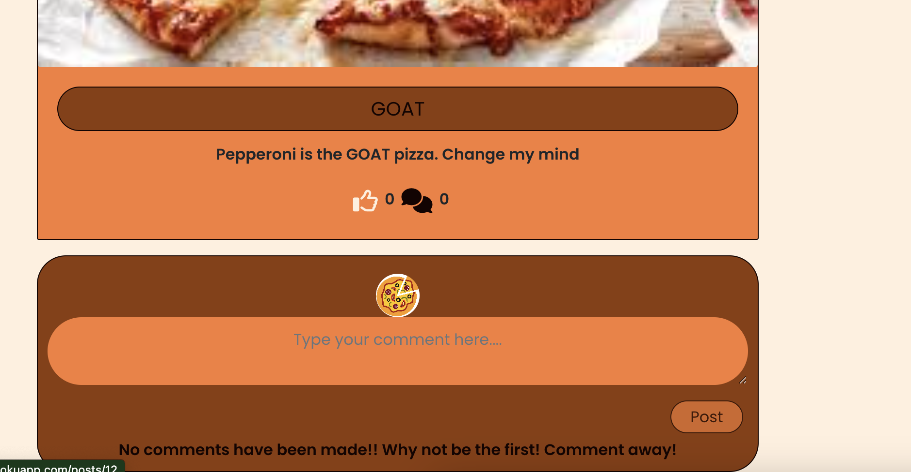
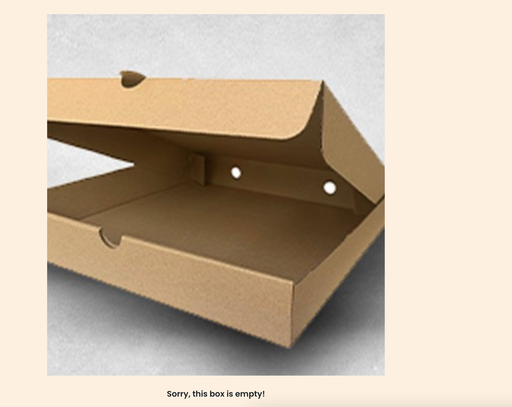

# Sliceshare

Sliceshare is a social website where users can upload stories, alongside images of their favourite pizza moments. Whether they be an avid Pizza Maker or just an enthusiastic Pizza Eater. People can share their learns or suggestions on their favourite recipes or places to eat.

Allowing a community feel where users can follow each other, like each others posts and comment on stories they value.

This repository is the Front End of that project made using ReactJS.

[Live Webpage](https://sliceshare.herokuapp.com/)

## Project Goals

### User Goals

1. Able to see posts made by someone I follow
2. View most recent Posts
3. Delete a post
4. Create a post
5. Search for posts
6. Add/delete comments to a post
7. View others profiles

### Site Owner Goals

8. Provide infinite scroll so no user interaction for more viewing
9. To provide a platform to build a community around pizza
10. Have navigation always visible for ease of use
11. Promote Italian culture through food

## User Experience

### Target Audience

- People looking into making homemade pizza
- People looking to learn about the origin of pizza
- People looking to understand the difference between a Romana and Neopolitan pizza
- People who enjoy cooking

### User Requirements and Expectations

- A easy to use navigation system
- Information that is relevant and easy to understand
- Functions and links that respond and work as expected
- Presentation and visual aesthetics regardless of screensize
- Accessibility

### User Stories

- As an authenticated user:
  - Create/update/delete a post
  - Create/update/delete a comment
  - Leave comments on post
  - Like posts
  - Follow/Unfollow other users

- As an unauthenticated user:
  - Create a profile
  - Look at posts
  - Unable to leave comments
  - Unable to amend posts

## Style Choices

### Design
The website is designed to encourage engagement on all topics pizza. User can create their own posts and follow people they share interest with/of. For the colours I have incorporated the colours of pizza dough and cheese.

### Colour Scheme

For the colour of the Home page I used [Coolors](https://coolors.co/) which allowed me to utilise the colour of the cheese/dough for a palette.

Colour Palette

 

### Font
For the font I used [Google Fonts](https://fonts.google.com/specimen/Poppins#styles) and went with Poppins as it provides a good clean text for reading.

### Structure

### Initial Framework

Before starting the website I used a framework design tool called [Whimsical](https://whimsical.com/) to mockup an initial design idea.

Desktop

 

Mobile

 

## Technologies Used

### Languages
- HTML
- CSS
- JavaScript
- React

### Frameworks and Tools
- ReactJS
  - Used to build components that collectively form a FE (Front End) app
- Django
  - Used to build the BE (Backend) database
- Git
  - For version control
- GitHub
  - For storing repository and agile Project dashboard
- Gitpod
  - IDE for coding
- Paint.NET
  - For amending images
- Whimsical
  - For wireframes
- Google Fonts
  - For importing desired fonts
- Coolors
  - For the colour pallette of choice
- Font Awesome
  - For icons
- Favicon.io
  - Used for favicon image
- [Am I Responsive](https://ui.dev/amiresponsive)
  - Used to check responsive design
- JWT Decode
  - Used to refresh tokens
- ElephantSQL
  - Used to house the database
- Heroku
  - Used for cloud deployment of the website
- Google Chrome Dev Tools

## Features
### Existing Features

- __Navigation Bar Desktop__

  - Featured on all pages, the full responsive navigation bar includes different links dependant on whether a user is logged in or not
  - This section will allow the user to easily navigate from page to page across all devices without having to revert back to the previous page via the ‘back’ button. 

  
  

- __Navigation Bar Mobile__

  - Featured on all pages, the full responsive navigation bar includes different links dependant on whether a user is logged in or not and mobile or desktop
  - This section will allow the user to easily navigate from page to page across all devices without having to revert back to the previous page via the ‘back’ button. 

  

- __The Home page__

  - The home page is the first area a User would see
  - This page includes posts made by users and can be seen by both logged in and out users to encourage participation
  - Users can continuously scroll ensuring a good user experience

  

- __The Post Page__ 

  - The post page is where a user can see an individual post
  - The user whether logged in or out can see comments left by other users 
  - Users who are authenticated can leave comments or likes on posts

  

- __Profile Page__

  - The profile page is where Users can see an individuals profile
  - Gives the main information of a user including the number of followers and how many posts they have
  - Users who are logged in can follow other users

  

- __Edit Profile__

  - The Edit Profile page is where users can setup all of their information with an about section
  - Whether they are an avid pizza maker or pizza eater
  - What their favourite pizza is
  - Give themselves a profile image

  

- __Not Found__

  - The Not Found page is a default placeholder to show a user a page does not exist

  

### Features Left to Implement

- To allow login via social platforms such as Google or Facebook
- Allow users to tag other users in comments or posts
- Allow users to repost others posts for further interest
- Search for users who are fellow makers/eaters

## Testing 

* ## Manual Testing
    * I planned and carried out the below manual tests for the pages. These were all met!

   * ### Manual Tests Conducted
      * Navigation Menu
        * Ensure that when the header is clicked it returns to the home page
        * Ensure that all navigation links correctly navigate to their respective pages when clicked
        * Ensure that all the :hover psuedo selectors work when using the navigation bar
        * Ensure the responsiveness of the navigation bar
      * Home/Landing Section
        * Ensure the posts display correctly
        * Ensure that the most followed profiles display correctly
        * Ensure that the infinite scroll feature works
        * Ensure the responsiveness of the page
        * Ensure that the font-style and size are visible and of good contrast
        * Ensure when clicking onto posts/users you are directed accordingly
      * Post Page
        * Ensure that the font-style and size are visible and of good contrast
        * Ensure that there are no spelling mistakes
        * Ensure that the images are not distorted
        * Ensure the responsiveness of the page
        * Ensure a logged out user cannot post a comment
        * Ensure the posts owner cannot like their own post
        * Ensure a logged in user can comment and like the post
        * Ensure a logged in user who is the owner of a comment can delete the comment
        * Ensure the owner of the post can delete the post or edit
        * Ensure all links to other pages work
      * Profile Page
        * Ensure that the images all load
        * Ensure that the profile information is loaded correctly
        * Ensure the responsiveness of the page
        * Ensure a logged in user who is not the owner of the profile can follow/unfollow
        * Ensure a logged in user who is the owner has access to the edit functionality
        * Ensure a logged in user who is the owner has access to change their password
        * Ensure all users can see that profile owners posts
      * Feed
        * Ensure that all required elements work
        * Ensure that the posts displayed are those of people who are followed by the user
        * Ensure that the font-style and size are visible and of good contrast
        * Ensure that there are no spelling mistakes
        * Ensure the responsiveness of the page
      * Edit Profile Page
        * Ensure that all current Profile information is prepopulate
        * Ensure the responsiveness of the page
        * Ensure when changes are made the browser responds
        * Ensure when the changes are submitted they are saved to the user in the database
        * Ensure all links work

### Perform test on devices
The website was tested on the following devices:
- MacBook Pro 13"
- MacBook Pro 13" with 17" monitor
- Iphone 7
- Iphone 11 Mini

In addition, the website was tested using Google Chrome Developer Tools Device Toggling option for all available device options.

### Browser compatability
The website was tested on the following browsers:
- Google Chrome
- Safari

## Bugs Fixed

### Unable to unfollow a user
  * A trailing '/' was causing the code to not be able to find the correct endpoint to delete

  

Trailing '/'

### Missed Profile Data Provider
  * After creating the Profile Data Provider I had initially forgot to wrap the index.js in the correct wrapper

  

Profile Data Provider

### Components

Custom components were created to anable the code and functionality to passed and 

- NavBar - NavBar component was created to be displayed on all pages and display different icons dependant on user status

- Asset - Asset component was created to allow the spinner to be displayed when data is loading

- Avatar - Avatare component was created to allow a user profile image to be shown on any required page

- NotFound - NotFound component was created to allow a page to be displayed should the requested URL not be found

- DropdownList - DropwownList component was created to allow multiple edit/delete dropdowns be shown

### Context

- Current User Context - Created to get the current users authentication and share with the other components. 

- Profile Data - Create to set Profile Data, allow Follow and Unfollow of user profiles

### Custom Hooks

- useRedirect - Created to redirect users to the correct page dependant on login status

- Click Outside toggle - Created to close the expanded menus should a click be performed anywhere outside the menu

## Testing User Stories

1. NavBar Available

| **Feature** | **Action** | **Expected Result** | **Actual Result** |
|-------------|------------|---------------------|-------------------|
| NavBar | From all pages NavBar can be seen | All pages have the navbar available | Works as expected |

  

User Story

 

2. View posts

| **Feature** | **Action** | **Expected Result** | **Actual Result** |
|-------------|------------|---------------------|-------------------|
| Home Page | When entering the site you are on the home page | All posts seen | Works as expected |

  

User Story

 

3. Infinite Scroll

| **Feature** | **Action** | **Expected Result** | **Actual Result** |
|-------------|------------|---------------------|-------------------|
| Home Page | When entering the site you are on the home page and can continually scroll | All posts seen | Works as expected |

  

User Story

 

4. Search

| **Feature** | **Action** | **Expected Result** | **Actual Result** |
|-------------|------------|---------------------|-------------------|
| Home Page Search Bar | When entering the site you are on the home page and have access to a search bar | All posts can be searched via keywords | Works as expected |

  

User Story

 

5. Delete a post

| **Feature** | **Action** | **Expected Result** | **Actual Result** |
|-------------|------------|---------------------|-------------------|
| Post Page | Logged in owner can use dropdown menu to delete a post | Post deleted by owner | Works as expected |

  

User Story

 

6. Add a user

| **Feature** | **Action** | **Expected Result** | **Actual Result** |
|-------------|------------|---------------------|-------------------|
| Signup Page | A logged out user can signup to the page and create a user | Create a user and it is accepted | Works as expected |

  

User Story

 

7. Followers posts

| **Feature** | **Action** | **Expected Result** | **Actual Result** |
|-------------|------------|---------------------|-------------------|
| Followers posts | A logged out user can set the feed and see posts from people they follow | When seeing the feed it is posts by the followed personnel only | Works as expected |

  

User Story

 

8. Create a post

| **Feature** | **Action** | **Expected Result** | **Actual Result** |
|-------------|------------|---------------------|-------------------|
| Create a post | A logged in user can create a post | When a user is logged in they can create a post | Works as expected |

  

User Story

 

9. Comment on a post

| **Feature** | **Action** | **Expected Result** | **Actual Result** |
|-------------|------------|---------------------|-------------------|
| Comment on a post | A logged in user can create a comment on a post | When a user is logged in they can create a comment on a post | Works as expected |

  

User Story

 

## Deployment

The website was deployed using Heroku by following these steps:
1. From Heroku dashboard select 'New App'
2. Select the required location and create using a unique name
3. Select the 'Deploy' tab and connect to the necessary GitHub repository
4. Utilise the automatic deployment so that each revision committed from Gitpod to Github creates an update to the App

You can for fork the repository by following these steps:
1. Go to the GitHub repository
2. Click on Fork button in upper right hand corner

You can clone the repository by following these steps:
1. Go to the GitHub repository 
2. Locate the Code button above the list of files and click it 
3. Select if you prefer to clone using HTTPS, SSH, or Github CLI and click the copy button to copy the URL to your clipboard
4. Open Git Bash
5. Change the current working directory to the one where you want the cloned directory
6. Type git clone and paste the URL from the clipboard ($ git clone https://github.com/YOUR-USERNAME/YOUR-REPOSITORY)
7. Press the Enter key to create your local clone.

The live link can be found here - https://sliceshare.herokuapp.com/

## Credits 

### Code

- The Moments walkthrough project was a great help in creating this website

### Content 

- The icons were taken from [Font Awesome](https://fontawesome.com/)
- The images were gathered from various webpages ensuring that they were open source mainly [Pexels](https://www.pexels.com/)
- The forms and styling were created using React-Bootstrap [React Bootstrap](https://react-bootstrap-v4.netlify.app/)

### Media

- The photos used on the site are from [Pexels](https://www.pexels.com/)
- The colours used on the site are found on [Coolors](https://coolors.co/)
- The favicon came from [Favicon](https://favicon.io/)